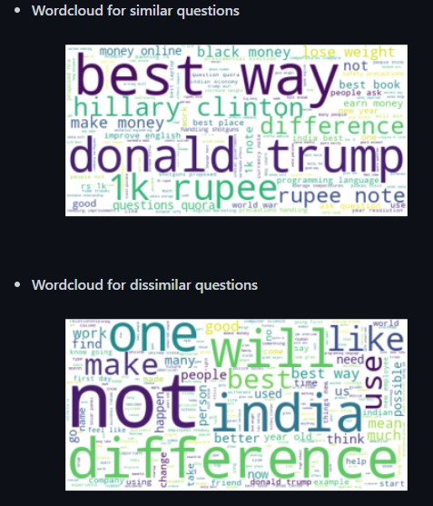

# Quora Question Pair Similarity

Over 100 million people visit Quora every month, so it's no surprise that many people ask similarly worded questions. Multiple questions with the same intent can cause seekers to spend more time finding the best answer to their question, and make writers feel they need to answer multiple versions of the same question. Quora values canonical questions because they provide a better experience to active seekers and writers, and offer more value to both of these groups in the long term.  so main aim of project is that predicting whether pair of questions are similar or not. This could be useful to instantly provide answers to questions that have already been answered.
   Credits: Kaggle
### Problem Statement :
Identify which questions asked on Quora are duplicates of questions that have already been asked.
### OUTPUT

### Real world/Business Objectives and Constraints :
   - The cost of a mis-classification can be very high.
   - You would want a probability of a pair of questions to be duplicates so that you can choose any threshold of choice.
   - No strict latency concerns.
   - Interpretability is partially important.

### Performance Metric:
    - Binary Confusion Matrix
### Data Overview:
Train.csv contains 5 columns : qid1, qid2, question1, question2, is_duplicate. Total we have 404290 entries. Splitted data into train and test with 70% and 30%.

### Feature Extraction:
- ##### Basic Features - Extracted some features before cleaning of data as below.
  - <b>freq_qid1</b> = Frequency of qid1's
  - <b>freq_qid2</b> = Frequency of qid2's
  - <b>q1len</b> = Length of q1
  - <b>q2len</b> = Length of q2
  - <b>q1_n_words</b> = Number of words in Question 1
  - <b>q2_n_words</b> = Number of words in Question 2
  - <b>word_Common</b> = (Number of common unique words in Question 1 and Question 2)

- ##### Extracted Tf-Idf features for this combained question1 and question2 and got 1,2,3 gram features with Train data. Transformed test data into same vector space. 
- ##### Got [Word Movers Distance](http://proceedings.mlr.press/v37/kusnerb15.pdf) with pretrained glove word vectors. 
- ##### From Pretrained glove word vectors got average word vector for question1 and question2. With this avg word vector got below distances. 
  - <b>Cosine distance</b>
  
  ### Machine Learning Models:
   - Trained a random model to check Worst case log loss and got log loss as 0.887699
   
##### References:
1. https://www.kaggle.com/c/quora-question-pairs 
2. https://www.kaggle.com/c/quora-question-pairs/discussion
